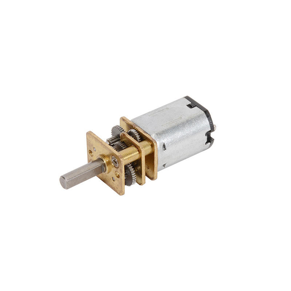
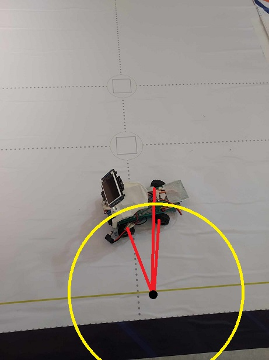
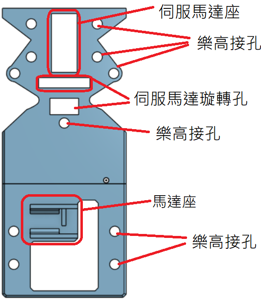
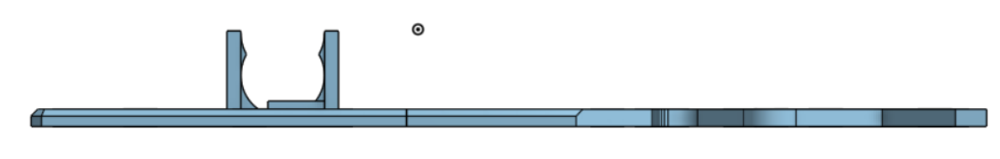

# 機器人比賽工程日誌 - 視覺感應避障電動車

## 簡介

歡迎來到我們的機器人比賽工程日誌！我們準備參加一場視覺感應避障電動車的比賽。我們的目標是製作一台自動導航並能根據視覺感應器來避免障礙物的電動車。這份日誌將記錄我們在組裝和優化車輛過程中的進展、挑戰和解決方案。

## 1. 馬達選擇

在初期階段，我們仔細考慮了不同的馬達選項，最終選擇了更小的N20馬達，而不是EV3樂高馬達。這個選擇不僅讓我們的車輛更加緊湊，還能提供更好的靈活性，以實現有效的障礙物避免。

## 2. 底盤設計

為了確保車輛的機動性，我們決定使用3D列印技術設計一個自定義的底盤，同時解決了遙控車底盤迴轉半徑過大的問題。這個決定將讓我們製作一個專為我們需求度身訂造的底盤，以提高整體性能。

### 遙控車迴轉半徑：

### 3D列印車迴轉半徑：

由上圖比對發現遙控車底盤迴轉半徑過大，可能影響閃避交通號誌，所以最終選擇用3D列印底盤車解決此問題。

## 3. 3D列印齒輪

為了確保馬達和樂高零件的齒輪相匹配，我們自行使用3D列印技術設計了合適的齒輪。這將實現在車輛內部有效地傳遞動力。

## 4. 馬達轉速

我們進行了馬達轉速的測試，以瞭解其性能特點。以下是馬達在不同電壓下的轉速測試結果：

## 5. 差速器齒輪比

為了實現差速操控，我們計算並設計了適合後輪的差速器齒輪比。

## 6. 裝配說明

以下是包括底盤和框架的裝配指南：

## 7. 3D元件三視圖

整個車輛元件的三視圖：

### 頂視圖：

### 正視圖：

### 側視圖：

## 總結

作為準備參加機器人比賽的參賽選手，我們致力於從理論到實踐，不斷優化我們的電動車項目。在視覺感應避障電動車的構建過程中，我們將著重於馬達、齒輪、感應器和差速器的組裝與優化。這個日誌將是我們工程進度的詳盡紀錄，同時也會反映出我們團隊的合作精神和創新思維。讓我們攜手合作，打造一輛優秀的視覺感應避障電動車。

