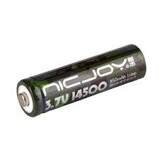
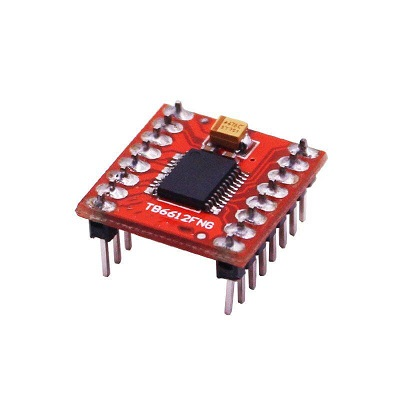
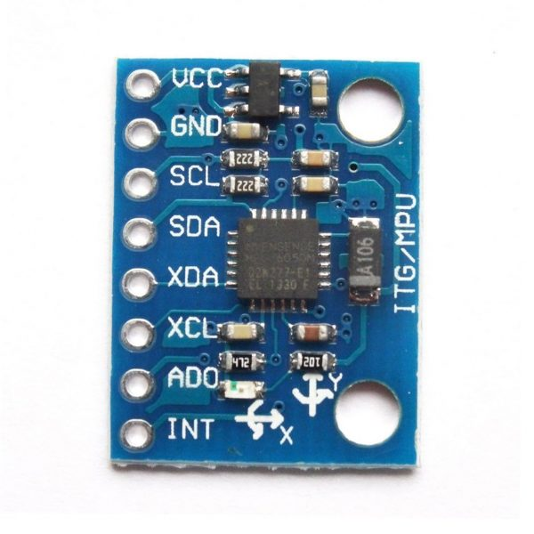
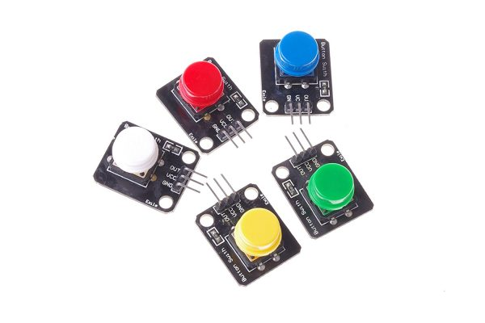

一. nicjoy14500金屬鋰電池

這是車輛的動力來源，提供電力給主控板、馬達以及其他電子裝置。選用金屬鋰電池而不是模型電池是因為nicjoy金屬鋰電池體積更小，更方便縮小車輛體積及配重。
一節電池電壓為3.7 ~ 4.2伏特，穩態電壓3.7伏特，我們使用兩節電池實際電壓為7.4 ~ 8.4伏特，電壓輸入到主控版後會經過穩壓晶片將電壓穩壓到5伏特和3.3伏特再分配到主控板和其他感應器。

二.主控板

Krduino主控板：這是整個車輛的主要控制板，負責管理和協調其他零件的運作。主控板通過程式碼控制各個感測器和執行器的動作，實現車輛的自主運行和障礙物避免功能。

   二-1 馬達驅動馬達驅動版tb6612

   tb6612是用於控制電動車的馬達。在車輛中，tb6612驅動晶片負責控制馬達的速度和方向，進而實現車輛的運動和轉向控制。已內建整合於主控板中。

   

三三.陀螺儀mpu6050

這是一個慣性感測器，能夠檢測車輛的傾斜和轉動。通過i2c通訊讀取陀螺儀數據，主控板可以判斷車輛的傾斜狀態，從而實現平穩的移動和轉向。

四.顏色感應器tcs34725

這個感應器可以識別周圍環境的顏色。在比賽中，我們通過i2c通訊讀取感應器數據來辨別地面狀態，以便車輛做出適當的反應和閃避動作。

五.攝影機esp32cam

攝影機是視覺感應器的一種，它可以拍攝周圍的場景。透過攝影機的影像處理，車輛可以識別前方的障礙物或路徑，並進行適應性的運動控制。

六.超音波hc-sr04

這個超音波感測器可以測量車輛與前方障礙物之間的距離。藉由這個數據，車輛可以避免與障礙物碰撞，實現安全的運行。

七.按鈕

按鈕是一種輸入裝置，可以用來控制車輛的啟動、停止或其他功能。在比賽中，我們將按鈕用來操控車輛的啟動。

八.三色指示燈

這些燈光裝置用來顯示車輛的狀態或提供提示信息。例如，可以利用指示燈顯示車輛是否處於運行中，或者是否偵測到了障礙物，若程式有誤還能方便及時更正程式。

