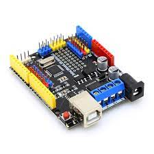
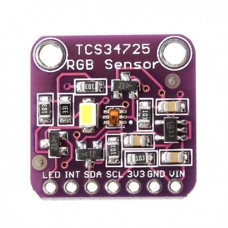

1.主控版

Krduino主控版：這是整個車輛的主要控制板，負責管理和協調其他零件的運作。主控版通過程式碼控制各個感測器和執行器的動作，實現車輛的自主運行和障礙物避免功能。

   1-1 穩壓晶片tb6612

   

1.陀螺儀mpu6050

這是一個慣性感測器，能夠檢測車輛的傾斜和轉動。通過讀取陀螺儀數據，主控板可以判斷車輛的傾斜狀態，從而實現平穩的移動和轉向。

2.顏色感應器tcs34725

這個感應器可以識別周圍環境的顏色。在比賽中，我們利用這個感應器來辨別地面狀態，以便車輛做出適當的反應和閃避動作。

3.攝影機esp32cam

攝影機是視覺感應器的一種，它可以拍攝周圍的場景。透過攝影機的影像處理，車輛可以識別前方的障礙物或路徑，並進行適應性的運動控制。

4.超音波hc-sr04

這個超音波感測器可以測量車輛與前方障礙物之間的距離。藉由這個數據，車輛可以避免與障礙物碰撞，實現安全的運行。

5.按鈕

按鈕是一種輸入裝置，可以用來控制車輛的啟動、停止或其他功能。在比賽中，我們將按鈕用來操控車輛的啟動。

6.三色指示燈

這些燈光裝置用來顯示車輛的狀態或提供提示信息。例如，可以利用指示燈顯示車輛是否處於運行中，或者是否偵測到了障礙物，若程式有誤更能方便及時更正程式。

14500coolook金屬鋰電池

這是車輛的動力來源，提供電力給主控版、馬達以及其他電子裝置。選用金屬鋰電池而不是模型電池是因為coolook金屬鋰電池體積更小，更方便縮小車輛體積及配重。

