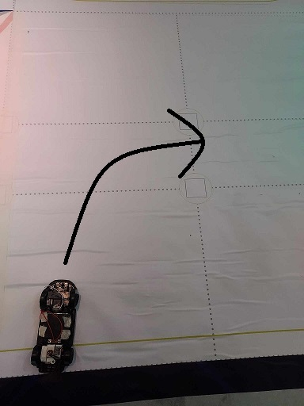
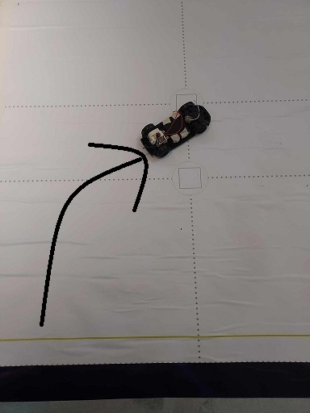
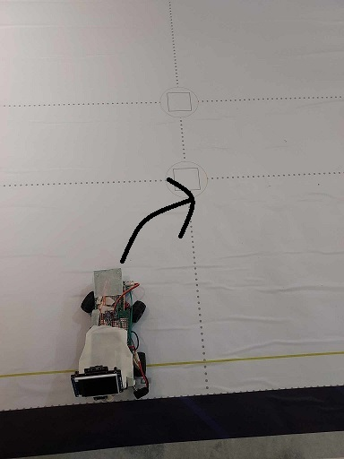
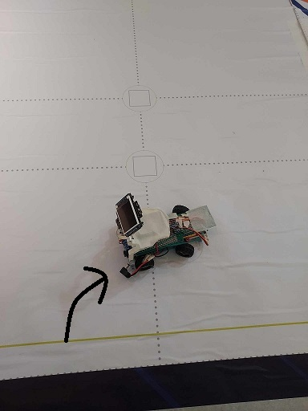

# 柒.工程因素及技術條件
這一個章節要呈現在實驗不同機構、感應器過程中遇到的問題，並說明我們如何解決、呈現最終結果。

## 一. 介紹舊車和改進後的車輛

### 1.舊車照片

這是改裝前的舊車底盤照片，使用的是EV3馬達，看起來是一輛體積相對稍大的車輛。

### 2.改進後的車輛

這是改進後的車輛照片，我們在改裝了底盤和馬達，加入了新的零件和設備，使車輛擁有了更多功能。

## 二. 焊接電路板和電路板功能

### 1.電路板接線設計圖

這是我們為電路板進行的接線設計圖，確保電路板的連接正確，以實現各個零件間的順利通訊。

### 2.電路板焊接過程

這是電路板焊接過程的照片，我們仔細地將各個電子元件焊接在電路板上，確保連接可靠且無誤。

### 3.電路板完成圖

這是已完成且裝配好的電路板照片，所有電子元件都已經焊接完成並接線正確。這個電路板是整個車輛的核心，它負責接收和處理各個感測器的數據，並控制馬達和其他執行器的動作，以實現車輛的自主運行和視覺感應閃避障礙物功能。

## 三. 底盤設計

為了確保車輛的機動性，我們決定使用3D列印技術設計一個自定義的底盤，同時解決了遙控車底盤迴轉半徑過大的問題。這個決定將讓我們製作一個專為我們需求度身訂造的底盤，以提高整體性能。

### 1.遙控車迴轉半徑：

### 2.3D列印車迴轉半徑：

由上圖比對發現遙控車底盤迴轉半徑過大，可能影響閃避交通號誌，所以最終選擇用3D列印底盤車解決此問題。
