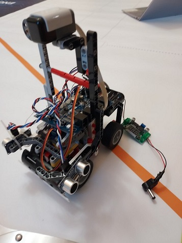
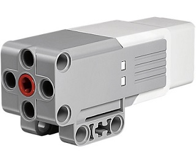
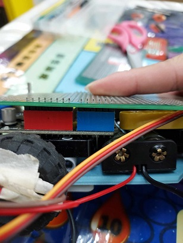
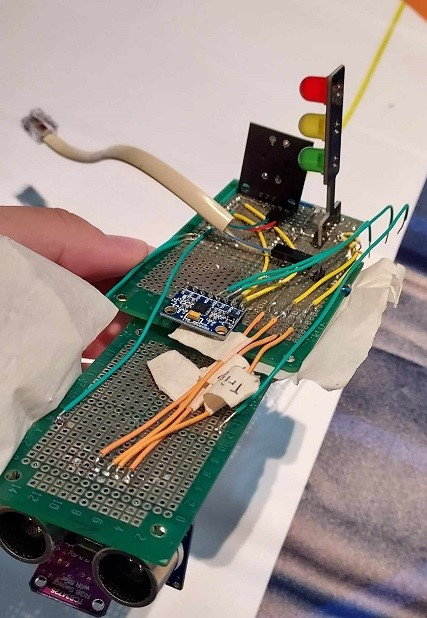

# 柒.工程因素及技術條件
這一個章節要呈現我們自行設計和製造車輛和部件，以及整合現成的電子零件。

## 一.現成電子零件

1.nicjoy14500金屬鋰電池

這是車輛的動力來源，提供電力給主控板、馬達以及其他電子裝置。選用金屬鋰電池而不是模型電池是因為nicjoy金屬鋰電池體積更小，更方便縮小車輛體積及配重。
一節電池電壓為3.7 ~ 4.2伏特，穩態電壓3.7伏特，我們使用兩節電池實際電壓為7.4 ~ 8.4伏特，電壓輸入到主控版後會經過穩壓晶片將電壓穩壓到5伏特和3.3伏特再分配到主控板和其他感應器。

2.主控板

Krduino主控板：這是整個車輛的主要控制板，負責管理和協調其他零件的運作。主控板通過程式碼控制各個感測器和執行器的動作，實現車輛的自主運行和障礙物避免功能。

   2-1 馬達驅動馬達驅動版tb6612

   tb6612是用於控制電動車的馬達。在車輛中，tb6612驅動晶片負責控制馬達的速度和方向，進而實現車輛的運動和轉向控制。已內建整合於主控板中。

   

2.陀螺儀mpu6050

這是一個慣性感測器，能夠檢測車輛的傾斜和轉動。通過i2c通訊讀取陀螺儀數據，主控板可以判斷車輛的傾斜狀態，從而實現平穩的移動和轉向。

3.顏色感應器tcs34725

這個感應器可以識別周圍環境的顏色。在比賽中，我們通過i2c通訊讀取感應器數據來辨別地面狀態，以便車輛做出適當的反應和閃避動作。

4.攝影機esp32cam

攝影機是視覺感應器的一種，它可以拍攝周圍的場景。透過攝影機的影像處理，車輛可以識別前方的障礙物或路徑，並進行適應性的運動控制。

5.超音波hc-sr04

這個超音波感測器可以測量車輛與前方障礙物之間的距離。藉由這個數據，車輛可以避免與障礙物碰撞，實現安全的運行。

6.按鈕

按鈕是一種輸入裝置，可以用來控制車輛的啟動、停止或其他功能。在比賽中，我們將按鈕用來操控車輛的啟動。

7.三色指示燈

這些燈光裝置用來顯示車輛的狀態或提供提示信息。例如，可以利用指示燈顯示車輛是否處於運行中，或者是否偵測到了障礙物，若程式有誤還能方便及時更正程式。

## 二. 介紹初代汽車和改進後的車輛

### 1.初代汽車照片

這是改裝前的初代汽車底盤照片，使用的是EV3馬達，整輛車幾乎都是用樂高零件組成，看起來是一輛體積相對稍大的車輛。

### 2.改進後的車輛

這是改進後的車輛照片，我們改裝了底盤和馬達，加入了新的零件和設備，使車輛體積縮小的同時擁有了更多功能。

## 二. 焊接電路板和電路板功能
我們加裝這塊電路板是因為之前沒電路板的機構容易因使用時常增加，導致杜邦線鬆，動進而引發接觸不良的問題，所以自己到電子材料行買了兩塊焊接板自己製作一塊電路板。

### 1.電路板接線設計圖

這是我們為電路板進行的接線設計圖，確保電路板的連接正確，以實現各個零件間的順利通訊。

### 2.電路板焊接過程

這是電路板焊接過程的照片，我們仔細地將各個電子元件焊接在電路板上，確保連接可靠且無誤。

### 3.電路板完成圖

### 4.電路板突發狀況

由於鄰近比賽，車輛上的krduino主控板晶片因操作不當導致短路燒壞控板，所以主控板臨時改成arduino UNO板。

由於krduino板和UNO板有一些腳位差異，所以將電路板的一些接角重新焊接。

這是已完成且裝配好的電路板照片，所有電子元件都已經焊接完成並接線正確。這個電路板是整個車輛的核心，它負責接收和處理各個感測器的數據，並控制馬達和其他執行器的動作，以實現車輛的自主運行和視覺感應閃避障礙物功能。
## 三. 底盤設計

為了確保車輛的機動性，我們決定使用3D列印技術設計一個自定義的底盤，同時解決了遙控車底盤迴轉半徑過大的問題。這個決定將讓我們製作一個專為我們需求度身訂造的底盤，以提高整體性能。

### 1. 遙控車迴轉半徑：

### 3D列印車迴轉半徑：

由上圖比對發現遙控車底盤迴轉半徑過大，可能影響閃避交通號誌，所以最終選擇用3D列印底盤車解決此問題。
